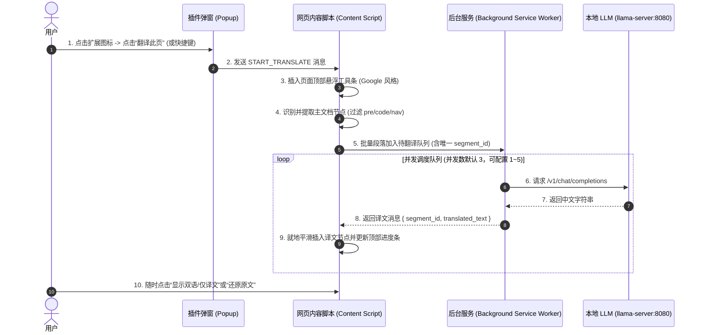

# EchoTranslate 项目实施计划 (Implementation Plan)

## 1. 目标描述 (Goal Description)
构建一款**完全基于本地 LocalLLM（如 llama-server/Ollama）、服务自主可控、保护隐私**的浏览器实时翻译扩展（适配 Chrome & Edge，采用 Manifest V3 标准）。
彻底解决前作“指哪译哪”在浏览 GitHub README 及技术长文时“上下文割裂、排版混乱、代码被误译、无法连贯阅读”的痛点。
在交互体验上深度对标**谷歌翻译（Google Translate）**与**沉浸式翻译**，提供：
- 点击图标快速唤起与翻译；
- 页面顶部轻量优雅的控制浮条（状态、进度、语言切换、双语/单语切换、还原原文）；
- 自动定位页面核心正文（智能适配 GitHub README、技术博客与主流文档），跳过代码块与侧边栏；
- 原生双语对照与译文渲染，通过本地 API 并发队列保证推理流畅不卡顿。

---

## 2. 需用户确认的事项 (User Review Required)

> [!IMPORTANT]
> **本地模型接口与运行状态确认**
> - 本扩展**不启动、不管理**任何本地 LLM 服务，仅作为 API 客户端调用用户已部署的 AI 服务。
> - 用户需自行启动并提供 OpenAI 兼容的 API 服务（如 WSL2 中的 vLLM、Ollama、llama-server 等）。
> - 默认对接本地标准接口：`http://127.0.0.1:8080/v1/chat/completions`，可通过 `config.json` 自定义。
> - **推荐模型**：`Qwen3.5-4B`（`C:\AI\models\qwen3.5-4b`）或 `Qwen2.5-3B-Instruct`（纯文本版，速度更快）。3B-4B 模型翻译质量足够且延迟更低。
> - **推荐部署方式**：在 WSL2 中运行 vLLM，提供更高的推理吞吐量和并发能力。

> [!NOTE]
> **开发规范与分发方式**
> - 项目采用标准原生 Web 技术栈（HTML5 + CSS3 + ES6 Modules），无需繁重的打包依赖，修改即生效，非常便于后期定制与在 Edge/Chrome 中“以开发者模式直接加载已解压的扩展”。

---

## 3. 待讨论问题 (Open Questions)

> [!TIP]
> 1. **默认展示模式**：您希望点击翻译后，默认是 **“双语对照（原文上方 + 中文下方）”** 还是类似谷歌翻译原生的 **“直接替换原文（鼠标悬停查看英文）”**？（计划中默认提供双语对照，并在顶部栏支持一键切换）。
> 2. **快捷键支持**：是否需要配置全局快捷键（如 `Alt + T`）在当前页面直接触发翻译？
> 3. **翻译范围**：是否只翻译主内容区（文章正文），还是整页翻译（包括侧边栏、导航等）？（计划中默认只翻译主内容区，避免干扰页面布局）

---

## 4. 架构与流程设计 (Architecture Flowchart)



---

## 5. 计划创建与修改的文件 (Proposed Changes)

项目根目录：`C:\AI\EchoTranslate`

### [Component: Extension Manifest & Configurations]
#### [NEW] `manifest.json`
- 声明 Manifest V3、扩展名称、版本、权限（`activeTab`, `storage`, `scripting`）、主机权限（`http://localhost:8080/*`, `http://127.0.0.1:8080/*`）。
- 注册 `background.service_worker`、`content_scripts`、`action` (popup) 及 `options_page`。

#### [NEW] `config.json`
- 用户自定义配置文件，用于指定 AI API 端点：
```json
{
  "api_url": "http://127.0.0.1:8080/v1/chat/completions",
  "model_name": "qwen3.5-4b",
  "max_concurrent": 3,
  "request_timeout_ms": 30000,
  "prompt_template": "你是一个专业的技术文档翻译器。请将以下英文技术文档翻译成中文：\n- 保持专业术语准确\n- 代码、变量名、函数名保持英文不变\n- 保持 Markdown 格式\n- 只输出翻译结果，不要解释"
}
```
- 扩展启动时读取此文件，用户也可通过 Options 页面修改并保存。

---

### [Component: UI - Popup & Options (类似谷歌翻译交互)]
#### [NEW] `popup/popup.html`, `popup/popup.css`, `popup/popup.js`
- 类似谷歌翻译的弹出气泡窗口：
  - 显示“页面语言检测（英文 -> 中文）”；
  - 核心操作大按钮：“翻译此页（Translate Page）”；
  - 辅助操作：“还原页面（Restore）”；
  - 状态指示灯：检测用户配置的 AI API 服务是否连通（在线/离线检测）；
  - 快捷入口：直达设置页。

#### [NEW] `options/options.html`, `options/options.css`, `options/options.js`
- 扩展详细设置面板（所有设置保存到 `config.json`）：
  - **API 端点配置**（默认 `http://127.0.0.1:8080/v1/chat/completions`）；
  - **模型名称配置**（默认 `qwen3.5-4b` / 自定义）；
  - **提示词 Prompt 模板自定义**；
  - **最大并发数限制**（默认 3，可配置 1~5）；
  - **请求超时时间**（默认 30 秒）；
  - **默认排版方式**（双语对照 / 纯译文替换）；
  - **本地翻译缓存管理**（清空缓存 / 查看缓存数量）；
  - **连接测试按钮**：一键测试 API 端点是否可达。

---

### [Component: Background Service Worker]
#### [NEW] `background/background.js`
- 核心职责：
  - **网络中转与防 CSP 拦截**：在插件后台向用户配置的 API 端点发送 fetch 请求，规避页面自身 CSP 限制。
  - **API 健康检查**：定时或按需 ping 用户配置的 API 端点，反馈连通状态（在线/离线）。
  - **并发控制队列（Priority Queue & Rate Limiter）**：限制并发数（默认 3，可配置 1~5），先进先出，支持在用户点击“停止/还原”时取消未发出的请求。
  - **本地结果缓存（Cache）**：利用 `chrome.storage.local` 对相同内容的 MD5/Hash 结果做本地缓存，二次浏览零等待。
  - **错误处理与重试**：
    - 每个 segment 请求设置 30 秒超时；
    - 失败后自动重试 1 次；
    - 重试仍失败则标记为“翻译失败”，在 UI 上显示并允许用户手动重试；
    - 单个 segment 失败不影响其他 segment 的翻译。
  - **翻译 Prompt 模板**（针对技术文档优化）：
    ```
    你是一个专业的技术文档翻译器。请将以下英文技术文档翻译成中文：
    - 保持专业术语准确
    - 代码、变量名、函数名保持英文不变
    - 保持 Markdown 格式
    - 只输出翻译结果，不要解释
    ```

---

### [Component: Content Script (DOM 识别、提取与就地渲染)]
#### [NEW] `content/content.js`
- 核心职责：
  - **主内容智能定位引擎**：
    - 优先级 1：GitHub README（`#readme, article.markdown-body`）；
    - 优先级 2：常见技术文章容器（`article, main, [role="main"], #content, .post-content, .documentation`）；
    - 优先级 3：通用正文容器兜底。
  - **标签过滤与语义段落切分**：
    - 纳入提取：`p`, `h1~h6`, `li`, `blockquote`, `th`, `td`；
    - 严格跳过：`pre`, `code`, `nav`, `header`, `footer`, `aside`, `.highlight`, `.octicon`, SVG 与徽章 badge；
    - **切分策略**：按语义段落切分（每个 `<p>`、`<li>`、`<h1~h6>` 为一个 segment），单个 segment 长度限制在 200-500 字符以内，过长则按句子进一步拆分。
  - **语言检测**：
    - 翻译前检测文本中文字符比例，若 >30% 则跳过（避免重复翻译中文内容）；
    - 仅对英文（或指定源语言）文本发起翻译请求。
  - **顶部悬浮控制栏（Top Banner）注入与生命周期管理**：
    - 动态向页面顶部挂载 Google 风格的横条；
    - 实时更新进度条（如 `已翻译 15/42 段`）；
    - 控制切换：双语模式、仅译文模式、还原模式。
  - **DOM 节点优雅就地插入**：
    - 原文段落打标并插入同级 `.echo-translate-item` 译文节点，保持原文档 CSS 继承与自适应宽度；
    - **原始 DOM 保存**：翻译前将每个 segment 的原始 HTML 保存到 `data-echo-original` 属性，确保“还原原文”功能可靠工作。

#### [NEW] `content/content.css`
- 页面内样式定义：
  - 顶部浮条动画与毛玻璃/现代卡片质感样式；
  - 译文段落的精细排版（柔和字体颜色、行距、翻译中脉冲动画效果、代码块保留原样）；
  - 翻译失败段落的视觉标识（如红色边框或图标）。

---

### [Component: Assets]
#### [NEW] `icons/icon16.png`, `icons/icon48.png`, `icons/icon128.png`
- 插件专属高清图标文件（SVG 动态生成或高精度 PNG）。

---

## 6. 验证计划 (Verification Plan)

### 阶段 1：API 服务与插件加载
1. 确保用户已部署并启动 AI API 服务（如 WSL2 中的 vLLM，监听 `http://127.0.0.1:8080`）；
2. 在 Edge/Chrome 打开 `edge://extensions/` 或 `chrome://extensions/`，点击“加载已解压的扩展”，选择 `C:\AI\EchoTranslate`；
3. 验证插件图标加载正常，点击弹窗显示 AI API 在线状态指示；
4. 测试 `config.json` 配置读取：修改 `api_url` 和 `model_name`，验证扩展使用新配置。

### 阶段 2：GitHub 真实场景全流程实测
1. 打开任意典型的英文开源项目 GitHub 主页（例如 `https://github.com/torvalds/linux` 或其他热门项目的 README）；
2. 点击右上角 EchoTranslate 扩展图标，点击 **“翻译此页”**；
3. 观察：
   - 页面顶部是否弹出类似谷歌翻译的控制条并显示实时翻译进度（含百分比，如 `已翻译 15/42 段 (36%)`）；
   - 代码块（`pre`、`code`、语法高亮框）是否完全保持英文原样未受干扰；
   - 段落、标题、列表项是否平滑插入中文译文；
   - 点击顶部栏的“仅看译文/双语对照”是否能无缝切换；
   - 点击“还原”是否瞬时恢复页面初始状态；
   - 中文内容（如页面中已有的中文评论）是否被正确跳过，未被重复翻译。

### 阶段 3：缓存与并发压力验证
1. 刷新该 GitHub 页面，再次点击“翻译此页”，验证是否命中本地缓存并在 100ms 内瞬间完成全页呈现；
2. 观察 AI API 服务（如 vLLM）控制台或日志，确认请求按设定的并发数（默认 3）有序进入，服务无过载或卡顿现象。

### 阶段 4：错误处理验证
1. 停止 AI API 服务（如 vLLM），点击“翻译此页”，验证是否显示友好的错误提示；
2. 重启 AI API 服务，验证是否能正常恢复翻译；
3. 测试单个 segment 翻译失败时的重试机制和 UI 标识；
4. 测试 API 端点配置错误时的错误提示。

### 阶段 5：不同页面类型测试
1. 测试技术博客（如 Medium、Dev.to）的翻译效果；
2. 测试长文档页面（如官方文档站）的翻译效果；
3. 测试包含大量中文的混合语言页面，验证语言检测是否正确跳过中文内容。
